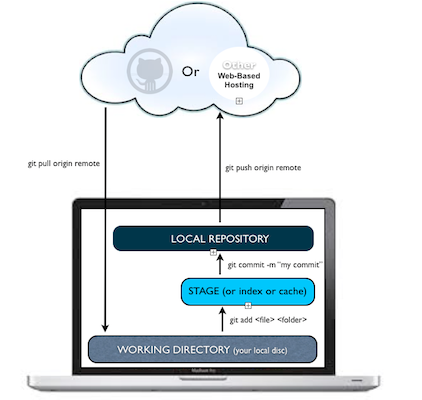

#BEWD - Working Like A Developer

---


##Agenda

*	What is Web Development?
*	Bash Commands
*	Using GitHub
* Introduction to Ruby

---

##Web Development
###The Web Application Stack


---

##Web Development
###Back-end vs Front-end Development

Let's define a few terms:

* _Web Development_ -> apps built for the web
* _Full-stack Development_ -> Applications built for the web
* _Front-End Development_ -> client / browser code (HTML, CSS, JS)
* _Back-End Development_ -> server-side code (Ruby, JS, GO, C#, .NET ... And many more)

---

##Work Like a Developer
###Integrate into the developer community

* Choose the right OS, editors, & tools for your projects.
  - Setup alias to sublime! (exercise in research [hint hipchat/google])
* Leverage the online community's vast libraries and documentation.
* Leverage the googlez.
  - [StackOverflow](http://stackoverflow.com/), [GitHub](https://github.com/), Forums
* Spread the knowledge you gain, and give back to the community when you can.
* Take pride & and joy in what you work on.
* Give back
  - Open source projects
  - Hackathons
  - Mentoring students
* Be efficient:
  * Use the keyboard as much as possible  (http://typing.io)
  * If you find yourself doing the same thing repeatedly, automate it

---

##The Command Line
###What is it?

The command line is a terminal giving you direct access to your operating system. You can enter simple commands to perform a variety of functions.

Many of the tasks we need to carry out (such as committing our code) are best performed in the command line.

---

##The Command Line
###How do I start?

For Macs:

* Open the "Terminal" app

  Navigate to `Terminal`

  `Applications > Utilities > Terminal`

* For a better experience, download and install "iTerm 2", which is a replacement app that is slightly better.


For Windows:

* Open the "Command Prompt" application
* For a better experience, try "Console" (http://sourceforge.net/projects/console/)

---

##The Command Line
###Why are we using it?

* In order to learn Ruby without Rails, we must learn how to run Ruby programs on their own.
* To do so, we can simply create "stand-alone" Ruby applications.
* A stand-alone Ruby app consists of one or more Ruby files (files that have a .rb extension)
* Once you have written a Ruby file, you can run the file by typing:
	* ```ruby file.rb``` (this would run a Ruby file named file.rb)
* This is the basis of how we will be writing and testing our Ruby applications in the initial portion of this course

---

* `pwd` - Present working directory  
* `ls` - List the contents of the directory  
* `cd` - Change directories  
* `mkdir` - Create a new folder  
* `rmdir` - Remove an empty folder  
* `rm` - Remove a file  
* `touch` - Create an empty file  
* `echo` - Return a string  
* `subl` - Open sublime text  
* `open` - Open particular files in their default application  

<!-- * `say` - Knight Riderify your computer   -->

---

### Always know where you are

* `./` - The current folder  
* `../` - One folder above your current working directory  
* `~/` - The home folder  

---


##Command Line Basics

---


##Command Line Basics Exercise

---

##Git
###What Is Git?

* Git is a source control management tool.
* Git allows you to store and update your code in a structured way.
* Git includes history of changes you make, so you can create "checkpoints" and track your work better over time.
* Git is an intelligent tool, and does many things for you automatically, but can be tricky to use in some cases. It takes a bit of learning to get fully comfortable with Git.

---

##Git
###What is GitHub?

* GitHub is a service that lets you host Git repositories in the cloud.
	* In other words, they are hosted remotely by GitHub, and can be downloaded from / uploaded to over the internet.
* GitHub allows you to easily distribute code to others by sharing your repository.
* GitHub lets you view your code online easily with a web interface.
* GitHub is free to use as long as you make your code public.
	* Private repositories cost a monthly fee.

---


##Git
###Git + GitHub Workflow Diagram



---


## Git
__Common commands__

* `git init` - Add git to the current folder  
* `git add path/to/file` - Adds files to the "stage"  
* `git reset HEAD path/to/file` - Removes files from the "stage"  
* `git checkout path/to/file` - Undo any changes to the file specified (changes are gone forever)  
* `git commit -m "Commit message"` - Commit the files to the timeline  
* `git log` - View the timeline  
* `git status` - View the current state of the repository  

---


##Git Basics

---


##GitHub
###What is a GitHub fork?

* As you work on projects in this class, we want you to use GitHub.
* To gain easy access to all the class files, you will check out the class GitHub repository on your machine.
* In order to ensure that changes you make for your projects do not mix with other students work, you will create a *fork* of the class GitHub repository.
* You will then make changes to your fork, and occasionally pull down changes from the origin class repository.

---

##GitHub
###GitHub Forks Diagram


---


##Git In Class

---


## Git It Together

---

## Enter, Ruby

```ruby
def underscoreize(string)
  string.downcase.gsub(' ', '_')
end

full_names = [
  'Brooks Swinnerton',
  'Luna The Cat',
  'Otto The Cat'
]

full_names.each do |name|
  %x( mkdir #{underscoreize(name)} )
  %x( touch #{underscoreize(name)}/.gitkeep )
end
```

---

## GitHub Forks

Developers are the biggest pirates in the world.


But it's encouraged! Enter, the fork.

---

## GitHub Exercise
[](https://materials.generalassemb.ly/bewd/13/lessons/1#classwork)

---

## Homework
<br><br>

* Review command line and GitHub
* Submit a recent profile picture to GitHub if you have not already
* Email one of us the link to your GitHub account if you have not already

> Email: bewd-nyc-15-instructors@ga-groups.com

