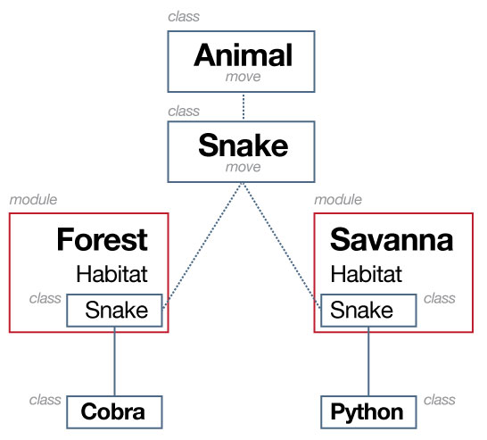

# Classes & Objects Continued


---

## Code Demo Creating Objects Review
[](https://materials.generalassemb.ly/bewd/13/lessons/6#classwork)

---

## The constructor

The constructor can also take in a set of default parameters for when you call `.new`.

```ruby
class Post
  def initialize(title)
    @title = title
  end

  def title
    @title
  end
end
```

Which allows you to do the following:

```ruby
first_post = Post.new('This is my first blog post')
first_post.title
#=> "This is my first blog post"
```

---

## Getters and Setters

Rather than manually creating your getters and setters, Ruby has a shortcut to do it for you.


---

## Getters before

```ruby
class Cat
  def initialize(color, name)
    @color = color
    @name = name
  end

  def color
    @color
  end

  def name
    @name
  end
end
```

---

## Getters after

```ruby
class Cat
  attr_reader :color, :name

  def initialize(color, name)
    @color = color
    @name = name
  end
end
```

---

## Setters before

```ruby
class Cat
  def color=(submitted_color)
    @color = submitted_color
  end

  def name=(submitted_name)
    @name = submitted_name
  end
end
```

---

## Setters after

```ruby
class Cat
  attr_writer :color, :name
end
```

---

## Getters and setters combined

If you want both a setter and a getter of an attribute on a class, you can use:

```ruby
class Cat
  attr_accessor :color, :name
end
```

---

## Blog Posts Code Along
[](https://materials.generalassemb.ly/bewd/13/lessons/6#classwork)

---

## What about when we want to use multiple classes?

---

## Folder structure

Its very likely that you're going to want to work with multiple classes in your program.

When doing so, we typically want to store separate classes in different files, following this folder structure:

```bash
/
./main.rb
./lib/
./lib/class_name.rb
```

---

## Accessing code in other files

Similarly to how we have to `require` code for Gems, we need to require code, _relative_ to the current file.

For example:

```ruby
require_relative 'lib/post'
require_relative 'lib/author'

blog_post = Post.new
blog_post.title = 'Cat saves the day'
blog_post.author = Author.new('Sandip', 'Trivedi')
```

---

## Code Along - Multiple Classes


---

## Exerice - Multiple Classes Exercise - Ruby Apartment Manager
[](https://materials.generalassemb.ly/bewd/13/lessons/7#classwork)

---

##Scope
###Method Scope

``` ruby

  def SuperHero
    def fly
      "Here we go!"
    end
  end

  def fly
    "I can't."
  end

  >> superman = SuperHero.new
  >> superman.fly
  => "Here we go!"
  >> fly
  => "I can't."

```
---

## Class methods

So far, we've covered instance methods, which can be called for an instantiated object, but what about for the class as a whole?

```ruby
class Parrot
  def self.species
    'Columba livia domestica'
  end
end
```

```ruby
Parrot.species
#=> "bird"
```

---

##Scope
###Class Methods

* You don't need an instance to call a class method
* Below is an example of the SecretNumber class re-implemented to use a class method
* BONUS: Go back and re-implement secret number exercise using a class method (HINT: the Game object stores the number, so you dont need a secret number object to do so)

  ``` ruby
  class SecretNumber
    # gets a random number between 0-9, adds one so it's between 1-10
    def self.generate
      rand(10)+1
    end
  end

  >> number = SecretNumber.generate
  ```

---

##Class Methods
###Knowing Self

* self keyword is used when defining a method name to indicate a class method
* self is also used INSIDE a method definition to indicate the current object
* a common use of self is to call the current objects methods (such as one of its attr_accessors)
* below, self is used to indicate that 'generate_random_story' is a class method
* in addition, self is then used to call the "stories" attr_accessor method on the NewsPaper instance (an attr_accessor getter method returns the instance variable e.g. @stories)

---

##Class Methods
###Knowing Self


``` ruby
class NewsPaper
  attr_accessor :stories

  def self.generate_random_story
    "This random event happened on day #{rand(28)} of this month."
  end

  def add_story(story)
    # the below code is the same as: @stories << story
    self.stories << story
  end
end

>> story = NewsPaper.generate_random_story
=> "This random event happened on day 20 of this month."
>> paper = NewsPaper.new
>> paper.add_story(story)
>> paper.stories
=> ["This random event happened on day 20 of this month."]
```

---


## Sharing behavior

There will come a time when you will find that you're repeating the same code in two different classes.

There are two ways to stay DRY (don't repeat yourself)

* Inheritance
* Mixins
* Modules

---

## Inheritance

```ruby
class User
  attr_accessor :name, :email, :password
end

class Administrator < User
  attr_accessor :privileges

  def initialize
    @privileges = ['read', 'write']
  end
end
```

```ruby
sandip = User.new
sandip.privileges
#=> NoMethodError: undefined method `privileges' for #<User:0x007f841246bc78>

otto = Administrator.new
otto.privileges
#=> ["read", "write"]
```

---

## Ruby's Inheritance tree

When I say that almost everything in Ruby is an object, I mean it.

```ruby
class Post
end

class TechnologyPost < Post
end
```

```ruby
TechnologyPost.parent
#=> Post
Post.parent
#=> Object
```

---

##Inheritance


---

##Inheritance
###Recap

* One class can inherit the capabilities of another using the ```<``` operator.
* Sub-class inherits from super-class (child class inherits from parent class)
* A child can override a parent variable or method by re-using its name
class.

* If defined in different physical files, a child must require its parent
* (this won't be the case in rails but is required with pure ruby)

---

## Modules

What about when it doesn't make sense to inherit from another class?

If you can abstract out the concept far enough, use a module.

---

## Modules

```ruby
module Votable
  attr_accessor :votes

  def upvote(votes)
    votes += 1
  end

  def downvote(votes)
    votes -=1
  end
end
```

```ruby
class Post
  include Votable

  def initialize
    @posts = 1
  end
end
```

---

##Sharing Behavior
###Mixins

* "Mixins" are a facility to import code into a class
* They are used in cases when we don't want to use inheritance
  * Perhaps we only want a few methods from a small module, not the whole class
  * A class may want to mixin many different modules, but you can only inherit from one class
* In Ruby, we use Modules to facilitate mixins

---

##Mixins
###Teddit as an example

* Lets say teddit now accepts photos, videos and stories.


* You can up and down vote all of them.


---

##Mixins
###Upvotable Example
``` ruby
  module Upvotable
    def upvote!
      @upvote += 1
    end

    def downvote!
      @upvote -= 1
    end
  end

  class Photo
    attr_reader :photographer, :resolution, :upvotes
    include Upvotable

    def initialize(photographer, resolution)
      @photographer = photographer
      @resolution = resolution
      @upvotes = 1
    end
  end

  class Story
    attr_reader :title, :author, :upvotes
    include Upvotable

    def initialize(title, author)
      @title = title
      @author = author
      @upvotes = 1
    end
  end

  >> story = Story.new
  >> story.upvote!
  >> photo = Photo.new
  >> photo.downvote!
```
---

##Sharing Behavior
###Modules

* What if we wanted to have two bat classes.
``` ruby
    class Bat
      def fly!
        puts "So free.. and blind"
      end
    end

    # Somewhere else in your code
    class Bat
      def made_of
        "wood"
      end
    end

    slugger = Bat.new
    slugger.fly?!??!
```
---

##Inheritance vs Mixins
###What's the difference?

* inheritance (class SomeClass < OtherClass) is used to _inherit_ the methods from one class into another class
* include (include SomeModule) is used to _import_ the methods from one module into a class

---

##Inheritance vs Mixins
###When to use which?

* really up to you
* adjective (mixin) vs noun (inheritance)
* http://stackoverflow.com/questions/1282864/ruby-inheritance-vs-mixins

---

## Code Along - Sharing Behavior


---

##RESOURCES: More on Modules
###Namespacing

* We can define methods/classes with the same name, but namespaced differently
* We would do this if (in example below) we wanted the Bat to behave differently depending on which namespace it belongs to
* You will rarely use module namespacing (not at all in this course)
```
  module Animal
    class Bat
      def fly!
        puts "So free.. and blind"
      end
    end
  end

  Animal::Bat.new

  module BaseballUtensils
    class Bat
      def made_of
        "wood"
      end
    end
  end

  BaseballUtensils::Bat.new
```
---


##RESOURCES: More on Modules
###Namespacing




---

<div id="resources">
## Resources: Sharing Behavior

Good code should be reused!

---

###Cheat Sheet

####load vs. require vs. include

Why do they all sound the same??!!!!

* load: inserts a file's contents
  * File can be loaded more than once.

    ```load 'config.rb'```

* require inserts parsed contents: We use it to require a class in another .rb file.
  * File is only required once.

    ```require 'config'```

* include 'mixes in' modules. Use to include modules and mixins.

    ```include 'my_module'```

---

####Inheritance
* One class can inherit the capabilities of another using ```<```
* Sub-class inherits from super-class
(child class inherits from parent class)

* If defined in different physical files, a child must require its parent

-- lib/person.rb --

```ruby
  class Person
  end

```

-- lib/worker.rb --

```ruby

  require 'lib/person'

  class Worker < Person
  end
```

---

Heres a lengthy example:

* Don't repeat yourself (DRY)
* Don't do this!

```ruby
  class ScienceSubteddit
      @@name = "Science"
      @@description = "Where we blow stuff up for fun"
      def self.welcome
        puts "Welcome to the #{@@name} Subteddit!"
        puts @@description
      end
  end

  class MoviesSubteddit
      @@name = "Movies"
      @@description = "Because the Matrix was awesome"
      def self.welcome
        puts "Welcome to the #{@@name} Subteddit!"
        puts @@description
      end
  end

  class SportsSubteddit
      @@name = "Sports"
      @@description = "We have big muscles and we run fast"
      def self.welcome
        puts "Welcome to the #{@@name} Subteddit!"
        puts @@description
      end
  end

  class RubySubteddit
      @@name = "Ruby"
      @@description = "Because Python Sucks"
      def self.welcome
        puts "Welcome to the #{@@name} Subteddit!"
        puts @@description
      end
  end
```

---

* This is a better approach and demonstrates the benefit of using Object Oriented programming.
  * News sections inherit from Subteddit.


```ruby
  class Subteddit
      @@name = ""
      @@description = ""
      def self.welcome
        puts "Welcome to the #{@@name} Subteddit!"
        puts @@description
      end
  end

  class ScienceSubteddit < Subteddit
      @@name = "Science"
      @@description = "Where we blow stuff up for fun"
  end

  class MoviesSubteddit < Subteddit
      @@name = "Movies"
      @@description = "Because the Matrix was awesome"
  end

  class SportsSubteddit < Subteddit
      @@name = "Sports"
      @@description = "We have big muscles and we run fast"
  end

  class RubySubteddit < Subteddit
      @@name = "Ruby"
      @@description = "Because Python Sucks"
  end
```

---

####Mixins

* Include a module in a class to access the module's methods. This also keeps code DRY.

```ruby
  module MyModule
      def module_method(parameters)
        return parameter
      end
  end
```

```ruby
  class MyClass
    include MyModule
  end


  my_object = MyClass.new
  my_object.module_method
```

---

####Modules

Ruby exposes much core functionality through modules

A commonly used built in module is Math
The :: operator is used to refer to a constant set in a module

```ruby
  puts Math.sqrt(9)
```

>3.0


```ruby
  puts Math::PI
```
>3.1415926

---

* A module is like a class, except
  * You cannot create a new instance of a module
  * You cannot extend a module to create a child module


* Modules are a way to add namespaces

Ruby docs have a full list of available modules.

---

__Method Scope__

```ruby
  class GA_course
    def initialize (course_name)
      @course_name = course_name
    end

    def announce_course
      puts "GA has a course on #{@course_name}"
    end

    def self.announce_courses
      puts "GA has a course on BEWD"
      puts "GA has a course on FEWD"
      puts "GA has a course on CSF"
      puts "GA has a course on DAT"
      puts "GA has a course on UXD"
      puts "GA has a course on PDM"
    end
  end

  my_course = GA_course.new("BEWD")
  my_course.announce_course #
  GA_Course.announce_courses
```

>GA has a course on BEWD

>GA has a course on BEWD
>GA has a course on FEWD
>GA has a course on CSF
>GA has a course on DAT
>GA has a course on UXD
>GA has a course on PDM

---

###Still Feel Lost?

Its ok, we will see these terms again in Rails, but you can also,

####Catch Up With These Resources

* Working with Enumerables [Video](http://vimeo.com/gatv/review/67752032/67e8f877bb)
  * password => BEWD_GA
* [Modules](http://marakana.com/bookshelf/ruby_tutorial/modules.html
)
* [Mixins](http://samwho.co.uk/blog/2011/09/12/ruby-mixins/)