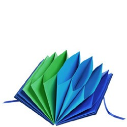

##BEWD - Collections & Loops

### Looping, Arrays & Hashes


---

##Agenda

*	Iteration - Loops
*	Collections
	*	Arrays
	*	Hashes

---

## Conditional Looping: Recap

__while__
```ruby
times_to_loop = 10
i = 0

while i < times_to_loop
  puts "This is the #{i} iteration"
  i += 1
end
```

__until__
```ruby
input = ''

until input == 'STAHP'
  puts "I know a song that gets on everybody's nerves"
end
```

---

##Iteration
###Repetition
###Repetition
###Repetition


---

## Iteration
__.times__

```ruby
3.times do
  puts 'beetlejuice'
end
```

What about `i`?

```ruby
10.times do |iteration_number|
  puts "This is the #{iteration_number} time this line has run"
end
```

---

## Iteration
__.upto__

```ruby
1.upto(5) do |n|
  sleep 1
  puts n
end
```

---

## Iteration
__.downto__

```ruby
10.downto(1) do |n|
  puts n
end

puts 'Liftoff'
```

---

##Iteration (Ruby-esque Loops)
###Less common in Ruby

*	These loops are less common in Ruby, but good to know as a programmer.

	*	X.times
	*	upto
	*	downto

* For additional help with syntax, see the Resources at the end of the slides.

---

##Conditional Loops

	count = 10
	while count > 0
		puts "Looping"
		count -=1
	end

	count = 10
	until count < 1
		puts "Looping"
		count -= 1
	end

	count = 10
	loop do
		break if count < 1
		puts "Looping"
		count -= 1
	end

---

## Iteration Exercise
[](https://materials.generalassemb.ly/bewd/13/lessons/3#classwork)

---

##Iteration Recap
###Recap

* 	Iteration in programming allows us to keep our code DRY
* 	Loops are used to repeat lines of code
* 	Common or Ruby-esque loops are
	*	.times
	*	.upto
	*	.downto
	* 	.each (we will see in a moment)

---

##Collections
###Working with Collections in Ruby

---


##Collections
###Arrays



---

## Collections - Arrays

Arrays can be thought of as a list. They are denoted by square brackets and can have _any_ data type inside of them.

```ruby
names = ['Sandip', 'Otto', 'Luna']
```

---

## Collections - Arrays
__Accessing the data in arrays__

There are a few different ways that you can access the data in arrays:

1. By referencing their index:

  ```ruby
  names = ['Sandip', 'Otto', 'Luna']
  names[0]

  #=> 'Sandip'
  ```

2. Using methods given to you by Ruby:
  e.g. `.first`, `.last`

  ```ruby
  names = ['Sandip', 'Otto', 'Luna']
  names.last

  #=> 'Luna'
  ```

---


##Arrays
###Find by Index

	my_array = ["NYC", "LA", "SYD", "LDN"]
	my_array[0] #"NYC"
	my_array[1] #"LA"
	my_array[-1] #"LDN"

---

##Arrays
###Find by Position

	my_array = ["NYC", "LA", "SYD", "LDN"]
	my_array.first #"NYC"
	my_array.last #"LDN"


	# In rails...
	# Will not work in IRB
	my_array = ["NYC", "LA", "SYD", "LDN"]
	my_array.second
	my_array.third
	my_array.forth
	my_array.fifth
	my_array.forty_two # known as the reddit

---

## Collections - Arrays
__Methods you can run on arrays__

There are numerous fun methods you can run on arrays:

```ruby
names = ['Sandip', 'Otto', 'Luna']

names.size
#=> 3
names.empty?
#=> false
names.reverse
#=> ['Luna', 'Otto', 'Sandip']
```

Try running `names.methods` to see more options.

---

##Arrays
###Array Methods

	name = "Sandip"
	name.upcase

	my_array = ["NYC", "LA", "SYD", "LDN"]
	my_array.reverse

---

## Collections - Arrays
__Manipulating data in arrays__

```ruby
lotto_numbers = [4, 5, 10, 11, 44, 47, 40]
```

Adding to the end (the shovel):

```ruby
lotto_numbers << 42
#=> [4, 5, 10, 11, 44, 47, 40, 42]
```

Removing from the end:

```ruby
lotto_numbers.pop
#=> 42
```

Removing from the front:

```ruby
lotto_numbers.shift
#=> 4
```

---

## Code Along - Arrays


---

## Arrays Exercise
[](https://materials.generalassemb.ly/bewd/13/lessons/3#classwork)

---

##Arrays
###Recap


*	A collection of data
*	Can search an array by index or position
*	Arrays are objects and therefore have methods.

---

## Collections - Hashes

A hash is a key, value pair. They can be thought of as a dictionary. For ever word, there is a corresponding definition.

Hashes are denoted by curly braces, with the key on the left, and the value on the right. In between the key and the value is either a hash rocket (`=>`), or a colon (`:`).

```ruby
person = {:name => 'Sandip', 'age' => 31}
```

---

##Collections
###Hashes


*	Often referred to as dictionaries
*	Each entry in a hash needs a *key* and a *value*
*	If you access a hash at a specific key, it will return the value at that key

---

## Collections - Hashes
__Accessing the data in hashes__
<br><br>

You access the value of a hash, by passing the key in between square brackets:

```ruby
person = {:name => 'Sandip', 'age' => 25}

person[:name]
#=> "Sandip"
person['age']
#=> 31
```

---

##Hashes
###Find by key

	ga_markets = {"NYC" => "New York City", "LA" => "Los Angeles", "SYD" => "Sydney", "LDN" => "London"}

	ga_markets["NYC"]
	ga_markets["LA"]
	ga_markets["SYD"]

"New York City"

"Los Angeles"

"Sydney"

---


##Hashes
###Setting Values

	user_hash = {}
	user_hash["name"] = "Sandip"
	user_hash["favorite_color"] = "Green"
	user_hash

	>> {"name"=>"Sandip", "favorite_color"=>"Green"}

---

## Collections - Hashes
__Keys and values can be of various data types__

The keys of a hash will commonly be set as a string:

```ruby
person = {'name' => 'Sandip'}
```

In which case, you'll have to address the key by it's data type:

```ruby
person['name']
#=> "Sandip"
```

But what about those symbols?

---

## Symbols

Symbols are very very similar to strings, the only difference is that they're more efficient to the computer. They're always denoted by a `:` and are always in lower case, with spaces as underscores.

```ruby
:sandip
:sandip_has_two_cats
```

What's different?

```ruby
"Sandip".object_id
#=> 70298548473960
"Sandip".object_id
#=> 70298548374580
```

```ruby
:sandip.object_id
#=> 3746728
:sandip.object_id
#=> 3746728
```

---

##Symbols
###New Ruby type

-	A symbol is a special type of object in ruby, used extensively
-	It is always preceded by a colon
-	Cannot contain spaces or numbers
-	Symbols are used because:
	-	they are immutable and take less memory
	-	they are easier to compare to other objects
	-	they are cleaner in syntax
-	Examples:
	-	```:hello```
	-	```:this_is_a_symbol```

---


##Symbols
###Primarily used as keys for hashes

	ga_markets = {}
	ga_markets = {:NYC => "New York City"}
	ga_markets[:LA] = "Los Angeles"
	ga_markets

	>> {:NYC => "New York City", :LA => "Los Angeles"}


---

##Hash
###Methods

	user = {user: "SandipTrivedi", email: "trivedi.sandip@gmail.com"}

	user.has_key? :email #true
	user.key? :email #true
	user.include? :email #true

	user.has_value? "SandipTrivedi" #true (note: extremely inefficient!)


---

## Collections - Hashes
__Hashes have cool methods too__

Whenever you want a symbol as the key, you can specify the hash as so:

```ruby
person = {name: 'Sandip', age: 31}

person[:age]
#=> 31
```

---

## Collections - Hashes
__Hashes have cool methods too__

```ruby
person = {name: 'Sandip', age: 31}

person.keys
#=> [:name, :age]
person.values
#=> ["Sandip", 31]
person.size
#=> 2
```

---

##Collections
###Array of Hashes

	users = [
		{user: "Sandip Trivedi", role: "Instructor"},
		{user: "Stephanie Morillo", role: "Expert In Residence"}
	]

---

##Iterating Over Collections
###.each

	ga_markets = ["NYC", "LA", "SYD", "LDN"]

	ga_markets.each {|market| puts market}

---

## Code Along - Hashes


---


##Lab Time
###Teddit Collections

---

##Recap
###Iterating Over Collections

---

## Homework


Work on Secret Number. Due next week (Monday)

---

## Resources: Collections, Loops and APIs

###Cheat Sheet

####Arrays

__Creating Arrays__

```ruby
my_array = ["Apples", "Oranges", "Pears"]
```

> ["Apples", "Oranges", "Pears"]

```ruby
my_array = Array.new
```

> []

```ruby
Array.new(3)
```

> [nil, nil, nil]

```ruby
Array.new(3, "BEWD")
```

> ["BEWD", "BEWD", "BEWD"]

__Assessing Elements__

```ruby
arr = ["NYC", "LDN", "LA", "SF", "BOS", "BER"]
arr[0]
arr[100]
arr[-3]
```

> NYC

> nil

> SF

```ruby
arr[2, 3] #=> [3, 4, 5]
```

> ["LA", "SF", "BOS"]

```ruby
arr[1..4]
```

> [LDN, LA, SF, BOS]

####Hashes

```ruby
	GA_Markets = { "New York City"=>"NYC", "London"=>"LDN", "Los 	Angeles"=>"LA", "San Francisco"=>"SF", "Boston"=>"BOS", 	"Berlin"=>"BER" }

	GA_Markets["London"]
```

> "LDN"

```ruby
	super_heros = { batman: "Bruce Wayne", superman: "Clark Kent", 	spiderman: "Peter Parker"}

	super_heros[:superman]
```

> "Clark Kent"

####Loops

__Iterator loop__

```ruby
4.times do
  puts "This will be printed 4 times"
end
```

> This will be printed 4 times

> This will be printed 4 times

> This will be printed 4 times

> This will be printed 4 times

__Each Loop__

```ruby
		# A list of GA Courses
		courses = [ "FEWD", "BEWD", "CSF" ]

	names.each do|n|
  		puts "GA has a course on #{n}"
	end
```

> GA has a course on FEWD

> GA has a course on BEWD

> GA has a course on CSF


###Tips, Tricks & Motivation

- [The Best Way to Learn Ruby & Rails](http://astonj.com/tech/best-way-to-learn-ruby-rails/)
-  What is iteration - [article](http://www.computerhope.com/jargon/i/iteration.htm)


###Still Feel Lost?
####Catch Up With These Resources

-	Teddit Hashes Answer [Video](http://vimeo.com/gatv/review/67752035/a90db9177f) by Steven Nuñez on behalf of General Assembly
	-	password=> BEWD_GA

-	Arrays [Ruby Docs](http://ruby-doc.org/core-2.0/Array.html)
-	Hashes [Ruby Docs](http://ruby-doc.org/core-2.0/Hash.html)
-	Hashes and Arrays [Tutorial](http://www.codecademy.com/courses/ruby-beginner-en-F3loB?curriculum_id=5059f8619189a5000201fbcb)
-	[*“Ruby-esque”* Loops](http://ruby.about.com/od/rubyfeatures/a/loops_2.htm) see page 1 for more ruby loops not covered in class.


